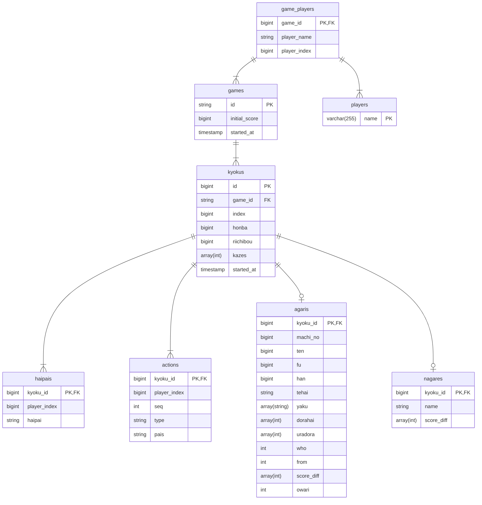

```mermaid
erDiagram
  game_players ||--|{ games : ""
  game_players ||--|{ players : ""
  games ||--|{ kyokus : ""
  kyokus ||--|{ haipais : ""
  kyokus ||--|{ actions : ""
  kyokus ||--o| agaris : ""
  kyokus ||--o| nagares : ""

  players {
    varchar(255) name PK
  }
  kyokus {
    bigint id PK
    string game_id FK
    bigint index
    bigint honba
    bigint riichibou
    array(int) kazes
    timestamp started_at
  }

  haipais {
    bigint kyoku_id PK,FK
    bigint player_index
    string haipai
  }

  actions {
    bigint kyoku_id PK,FK
    bigint player_index
    int seq
    string type
    string pais
  }

  agaris {
    bigint kyoku_id PK,FK
    bigint machi_no
    bigint ten
    bigint fu
    bigint han
    string tehai
    array(string) yaku
    array(int) dorahai
    array(int) uradora
    int who
    int from
    array(int) score_diff
    int owari
  }

  nagares {
    bigint kyoku_id PK,FK
    string name
    array(int) score_diff
  }

  game_players {
    bigint game_id PK, FK
    string player_name
    bigint player_index
  }
  games {
    string id PK
    bigint initial_score
    timestamp started_at
  }
```