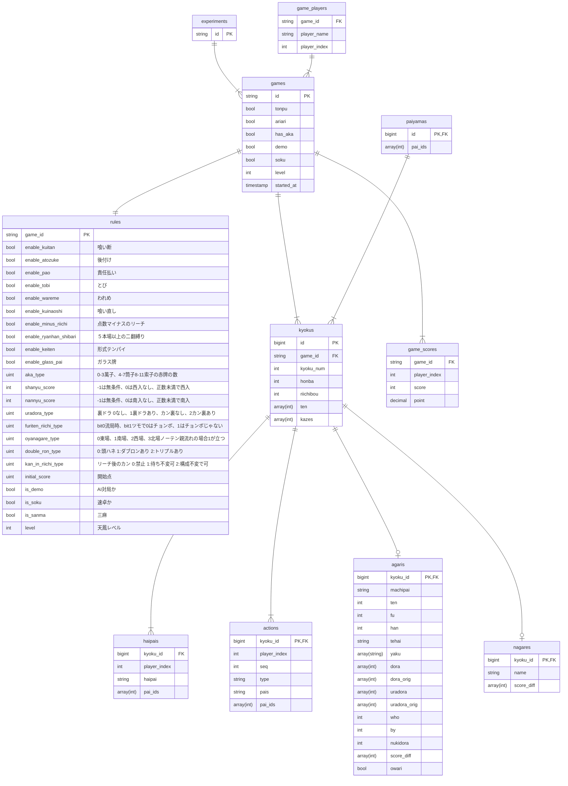

```mermaid
erDiagram
  experiments ||--|{ games : ""
  game_players ||--|{ games : ""
  games ||--|| rules : ""
  games ||--|{ kyokus : ""
  games ||--|{ game_scores : ""
  paiyamas ||--|{ kyokus : ""
  kyokus ||--|{ haipais : ""
  kyokus ||--|{ actions : ""
  kyokus ||--o| agaris : ""
  kyokus ||--o| nagares : ""

  experiments {
    string id PK
  }

  rules {
    string game_id PK
    bool enable_kuitan "喰い断"
    bool enable_atozuke "後付け"
    bool enable_pao "責任払い"
    bool enable_tobi "とび"
    bool enable_wareme "われめ"
    bool enable_kuinaoshi "喰い直し"
    bool enable_minus_riichi "点数マイナスのリーチ"
    bool enable_ryanhan_shibari "５本場以上の二翻縛り"
    bool enable_keiten "形式テンパイ"
    bool enable_glass_pai "ガラス牌"
    uint aka_type "0-3萬子、4-7筒子8-11索子の赤牌の数"
    int shanyu_score "-1は無条件、0は西入なし、正数未満で西入"
    int nannyu_score "-1は無条件、0は南入なし、正数未満で南入"
    uint uradora_type "裏ドラ 0なし、1裏ドラあり、カン裏なし、2カン裏あり"
    uint furiten_riichi_type "bit0流局時、bit1ツモで0はチョンボ、1はチョンボじゃない"
    uint oyanagare_type "0東場、1南場、2西場、3北場ノーテン親流れの場合1が立つ"
    uint double_ron_type "0:頭ハネ 1:ダブロンあり 2:トリプルあり"
    uint kan_in_riichi_type "リーチ後のカン 0:禁止 1:待ち不変可 2:構成不変で可"
    uint initial_score "開始点"
    bool is_demo "AI対局か"
    bool is_soku "速卓か"
    bool is_sanma "三麻"
    int level "天鳳レベル"
  }

  kyokus {
    bigint id PK
    string game_id FK
    int kyoku_num
    int honba
    int riichibou
    array(int) ten
    array(int) kazes
  }

  paiyamas {
    bigint id PK,FK
    array(int) pai_ids
  }

  haipais {
    bigint kyoku_id FK
    int player_index
    string haipai
    array(int) pai_ids
  }

  actions {
    bigint kyoku_id PK,FK
    int player_index
    int seq
    string type
    string pais
    array(int) pai_ids
  }

  agaris {
    bigint kyoku_id PK,FK
    string machipai
    int ten
    int fu
    int han
    string tehai
    array(string) yaku
    array(int) dora
    array(int) dora_orig
    array(int) uradora
    array(int) uradora_orig
    int who
    int by
    int nukidora
    array(int) score_diff
    bool owari
  }

  nagares {
    bigint kyoku_id PK,FK
    string name
    array(int) score_diff
  }

  game_scores {
    string game_id FK
    int player_index
    int score
    decimal point
  }

  game_players {
    string game_id FK
    string player_name
    int player_index
  }
  games {
    string id PK
    bool tonpu
    bool ariari
    bool has_aka
    bool demo
    bool soku
    int level
    timestamp started_at
  }
```
