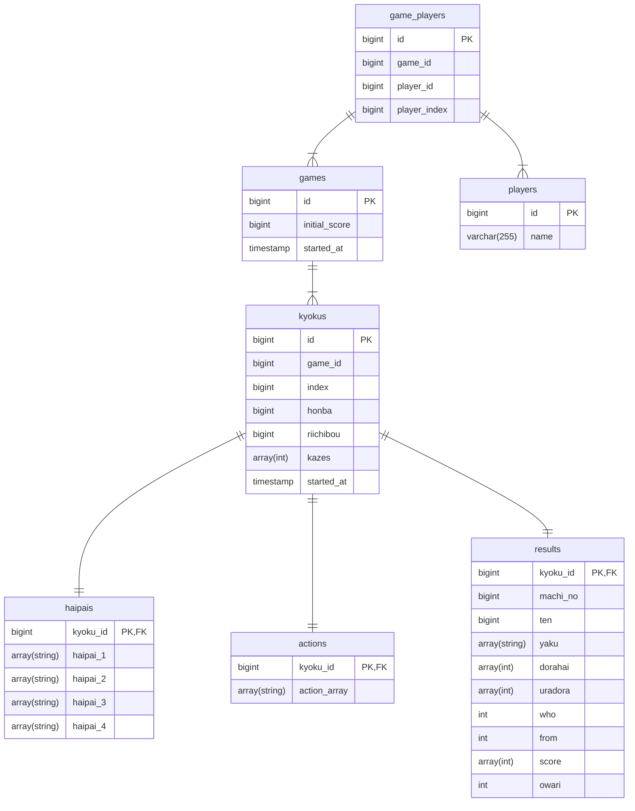

```mermaid
erDiagram
  game_players ||--|{ games : ""
  game_players ||--|{ players : ""
  games ||--|{ kyokus : ""
  kyokus ||--|| haipais : ""
  kyokus ||--|| actions : ""
  kyokus ||--|| results : ""

  players {
    bigint id PK
    varchar(255) name
  }
  kyokus {
    bigint id PK
    bigint game_id
    bigint index
    bigint honba
    bigint riichibou
    array(int) kazes
    timestamp started_at
  }

  haipais {
    bigint kyoku_id PK,FK
    array(string) haipai_1
    array(string) haipai_2
    array(string) haipai_3
    array(string) haipai_4
  }

  actions {
    bigint kyoku_id PK,FK
    array(string) action_array
  }

  results {
    bigint kyoku_id PK,FK
    bigint machi_no
    bigint ten
    array(string) yaku
    array(int) dorahai
    array(int) uradora
    int who
    int from
    array(int) score
    int owari
  }
  game_players {
    bigint id PK
    bigint game_id
    bigint player_id
    bigint player_index
  }
  games {
    bigint id PK
    bigint initial_score
    timestamp started_at
  }
```