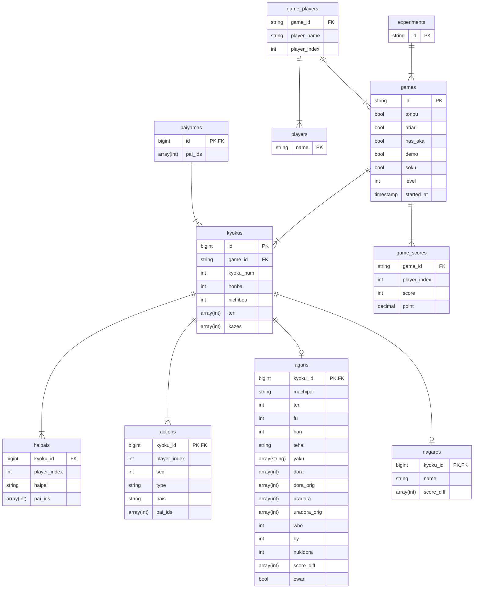

```mermaid
erDiagram
  experiments ||--|{ games : ""
  game_players ||--|{ games : ""
  game_players ||--|{ players : ""
  games ||--|{ kyokus : ""
  games ||--|{ game_scores : ""
  paiyamas ||--|{ kyokus : ""
  kyokus ||--|{ haipais : ""
  kyokus ||--|{ actions : ""
  kyokus ||--o| agaris : ""
  kyokus ||--o| nagares : ""

  experiments {
    string id PK
  }

  players {
    string name PK
  }

  kyokus {
    bigint id PK
    string game_id FK
    int kyoku_num
    int honba
    int riichibou
    array(int) ten
    array(int) kazes
  }

  paiyamas {
    bigint id PK,FK
    array(int) pai_ids
  }

  haipais {
    bigint kyoku_id FK
    int player_index
    string haipai
    array(int) pai_ids
  }

  actions {
    bigint kyoku_id PK,FK
    int player_index
    int seq
    string type
    string pais
    array(int) pai_ids
  }

  agaris {
    bigint kyoku_id PK,FK
    string machipai
    int ten
    int fu
    int han
    string tehai
    array(string) yaku
    array(int) dora
    array(int) dora_orig
    array(int) uradora
    array(int) uradora_orig
    int who
    int by
    int nukidora
    array(int) score_diff
    bool owari
  }

  nagares {
    bigint kyoku_id PK,FK
    string name
    array(int) score_diff
  }

  game_scores {
    string game_id FK
    int player_index
    int score
    decimal point
  }

  game_players {
    string game_id FK
    string player_name
    int player_index
  }
  games {
    string id PK
    bool tonpu
    bool ariari
    bool has_aka
    bool demo
    bool soku
    int level
    timestamp started_at
  }
```
